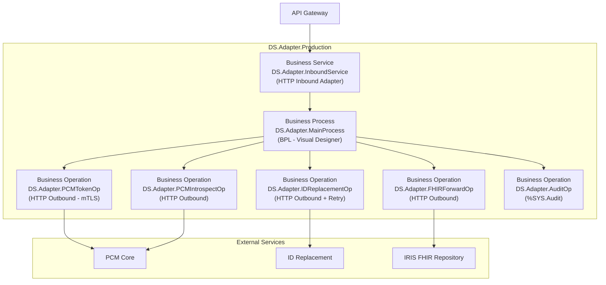
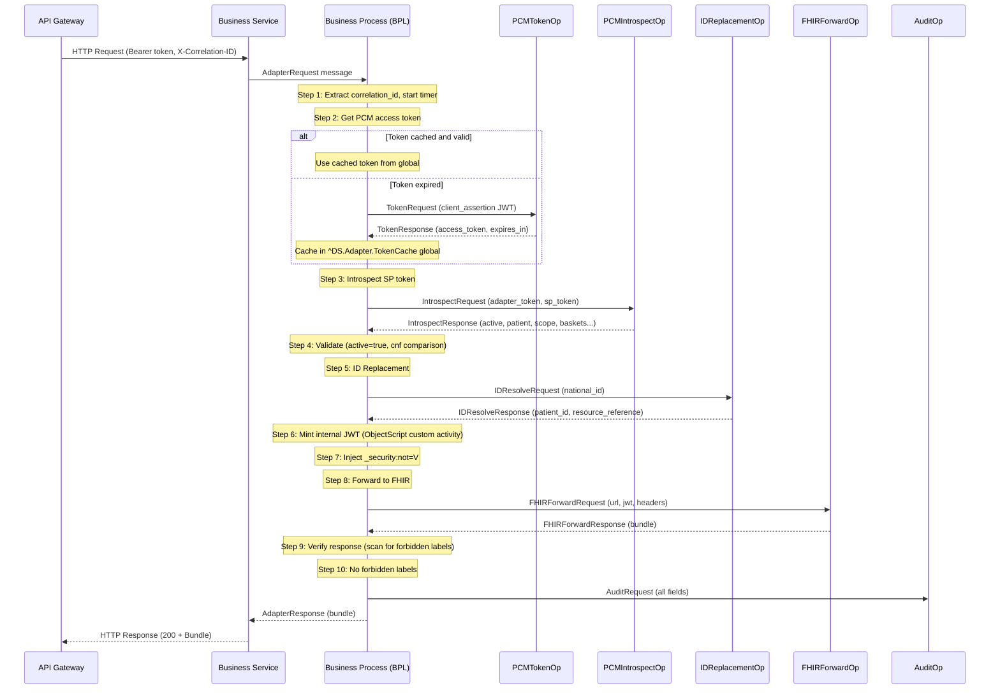

# מסמך עיצוב מפורט — Data Source Adapter (InterSystems IRIS)

## 1. סקירת ארכיטקטורה

### 1.1 Interoperability Production Architecture



### 1.2 Request Flow — Sequence Diagram (Happy Path)



### 1.3 Error Flows

זהים ל-Python — אותם תרחישים, אותם error codes, אותם HTTP status codes.
ההבדל: ב-IRIS, errors מנוהלים דרך BPL error handling (On Error) ו-Business Operation retry policies.

---

## 2. Message Classes (ObjectScript)

### 2.1 Request/Response Messages

```objectscript
/// Inbound request from Business Service
Class DS.Adapter.Messages.AdapterRequest Extends Ens.Request
{
    Property Method As %String;
    Property Path As %String;
    Property QueryString As %String;
    Property BearerToken As %String;
    Property CorrelationId As %String;
    Property SourceIP As %String;
    Property Headers As %String;  // JSON serialized
    Property Body As %Stream.GlobalCharacter;
}

/// Response back to Business Service
Class DS.Adapter.Messages.AdapterResponse Extends Ens.Response
{
    Property StatusCode As %Integer;
    Property Headers As %String;  // JSON serialized
    Property Body As %Stream.GlobalCharacter;
    Property CorrelationId As %String;
    Property Error As %String;  // OperationOutcome JSON if error
}
```

### 2.2 PCM Token Messages

```objectscript
Class DS.Adapter.Messages.TokenRequest Extends Ens.Request
{
    Property ClientAssertionJWT As %String(MAXLEN=4096);
}

Class DS.Adapter.Messages.TokenResponse Extends Ens.Response
{
    Property AccessToken As %String(MAXLEN=2048);
    Property TokenType As %String;
    Property ExpiresIn As %Integer;
}
```

### 2.3 Introspection Messages

```objectscript
Class DS.Adapter.Messages.IntrospectRequest Extends Ens.Request
{
    Property AdapterAccessToken As %String(MAXLEN=2048);
    Property SPOpaqueToken As %String(MAXLEN=4096);
}

Class DS.Adapter.Messages.IntrospectResponse Extends Ens.Response
{
    Property Active As %Boolean;
    Property Patient As %String;  // national ID
    Property Scope As %String(MAXLEN=4096);
    Property ConsentId As %String;
    Property Baskets As %String(MAXLEN=32000);  // JSON array
    Property AccessType As %String;  // "continuous" | "one-time"
    Property SPOrganizationId As %String;
    Property CnfThumbprint As %String;
    Property Exp As %Integer;
}
```

### 2.4 ID Replacement Messages

```objectscript
Class DS.Adapter.Messages.IDResolveRequest Extends Ens.Request
{
    Property NationalIdSystem As %String;
    Property NationalIdValue As %String;
}

Class DS.Adapter.Messages.IDResolveResponse Extends Ens.Response
{
    Property PatientId As %String;
    Property ResourceReference As %String;
    Property Error As %String;  // "patient_not_found" | "service_unavailable" | ""
}
```

### 2.5 FHIR Forward Messages

```objectscript
Class DS.Adapter.Messages.FHIRForwardRequest Extends Ens.Request
{
    Property URL As %String(MAXLEN=4096);
    Property Method As %String;
    Property InternalJWT As %String(MAXLEN=4096);
    Property Body As %Stream.GlobalCharacter;
    Property CorrelationId As %String;
}

Class DS.Adapter.Messages.FHIRForwardResponse Extends Ens.Response
{
    Property StatusCode As %Integer;
    Property Body As %Stream.GlobalCharacter;
    Property ContentType As %String;
}
```

### 2.6 Audit Message

```objectscript
Class DS.Adapter.Messages.AuditRequest Extends Ens.Request
{
    Property Timestamp As %String;  // ISO 8601
    Property CorrelationId As %String;
    Property SourceIP As %String;
    Property Method As %String;
    Property Path As %String;
    Property FHIRScope As %String;
    Property PatientId As %String;  // masked
    Property SPOrganizationId As %String;
    Property ConsentId As %String;
    Property ResponseStatus As %Integer;
    Property ResponseTimeMs As %Float;
    Property Error As %String;
    Property Severity As %String;  // "info" | "warning" | "critical"
}
```

---

## 3. Business Process (BPL) Design

### 3.1 Main Process Flow (BPL Steps)

| Step | Type | Name | Description |
|------|------|------|-------------|
| 1 | Assign | ExtractContext | חילוץ correlation_id, source_ip, start timer |
| 2 | Call | GetPCMToken | קריאה ל-PCMTokenOp (או שימוש ב-cache) |
| 3 | If | CheckTokenCached | בדיקה אם token ב-cache ותקף |
| 4 | Call | Introspect | קריאה ל-PCMIntrospectOp |
| 5 | If | CheckActive | בדיקת active=true |
| 6 | Code | ValidateCnf | ObjectScript: השוואת cnf (warning only) |
| 7 | Call | ResolveID | קריאה ל-IDReplacementOp |
| 8 | If | CheckIDFound | בדיקה שהמטופל נמצא |
| 9 | Code | MintJWT | ObjectScript: יצירת JWT פנימי (ES256) |
| 10 | Code | InjectSecurity | ObjectScript: הזרקת _security:not=V |
| 11 | Call | ForwardFHIR | קריאה ל-FHIRForwardOp |
| 12 | Code | VerifyResponse | ObjectScript: סריקת תגיות אסורות |
| 13 | If | CheckForbidden | בדיקה אם נמצאה תגית אסורה |
| 14 | Call | WriteAudit | קריאה ל-AuditOp |
| 15 | Reply | ReturnResponse | החזרת תשובה ל-Business Service |

### 3.2 Error Handling (BPL)

| Error Source | BPL Handler | Action |
|-------------|-------------|--------|
| PCMTokenOp fails | On Error | Return 502 (PCM_001) |
| IntrospectOp: active=false | If branch | Return 401 (AUTH_002) |
| IDReplacementOp: 404 | If branch | Return 404 (ID_002) |
| IDReplacementOp: timeout | On Error (after retries) | Return 502 (ID_001) |
| FHIRForwardOp: timeout | On Error | Return 504 (FHIR_002) |
| FHIRForwardOp: error | On Error | Return 502 (FHIR_001) |
| VerifyResponse: forbidden | If branch | Return 400 (generic) |
| Any unexpected error | Catch All | Return 500 (GEN_001) |

### 3.3 Custom ObjectScript Activities

Activities שלא ניתנות לביצוע ב-BPL visual ודורשות ObjectScript:

1. **MintJWT** — יצירת JWT חתום ב-ES256
2. **ValidateCnf** — השוואת certificate thumbprint
3. **InjectSecurity** — מניפולציה של query string
4. **VerifyResponse** — סריקת JSON Bundle לתגיות

---

## 4. Business Operations Configuration

### 4.1 PCMTokenOp

| Setting | Value |
|---------|-------|
| HTTP Server | `pcm-core` |
| HTTP Port | `3000` |
| URL | `/token` |
| SSL Configuration | `DS.Adapter.PCM.SSL` (if mtls_client=true) |
| Content-Type | `application/x-www-form-urlencoded` |
| Retry Count | 0 (no retry on token acquisition) |

### 4.2 PCMIntrospectOp

| Setting | Value |
|---------|-------|
| HTTP Server | `pcm-core` |
| HTTP Port | `3000` |
| URL | `/introspect` |
| SSL Configuration | `DS.Adapter.PCM.SSL` (if mtls_client=true) |
| Content-Type | `application/x-www-form-urlencoded` |
| Retry Count | 0 |

### 4.3 IDReplacementOp

| Setting | Value |
|---------|-------|
| HTTP Server | configurable |
| HTTP Port | configurable |
| URL | `/api/v1/resolve` |
| Content-Type | `application/json` |
| Response Timeout | 1 second (configurable) |
| Retry Count | 3 (configurable) |
| Retry Interval | 0.5 seconds (configurable) |
| Failure Timeout | -1 (no suspend) |

### 4.4 FHIRForwardOp

| Setting | Value |
|---------|-------|
| HTTP Server | configurable (FHIR server host) |
| HTTP Port | configurable |
| SSL Configuration | configurable (if HTTPS) |
| Response Timeout | 30 seconds (configurable) |
| Retry Count | 0 |

---

## 5. Token Cache (IRIS Global)

```objectscript
/// Global structure for token cache
/// ^DS.Adapter.TokenCache("access_token") = <token_value>
/// ^DS.Adapter.TokenCache("expires_at") = <unix_timestamp>

ClassMethod GetCachedToken() As %String
{
    Set expiresAt = $Get(^DS.Adapter.TokenCache("expires_at"), 0)
    If ($ZTimestamp > expiresAt) {
        Quit ""  // expired or not cached
    }
    Quit $Get(^DS.Adapter.TokenCache("access_token"), "")
}

ClassMethod CacheToken(token As %String, expiresIn As %Integer)
{
    Set ^DS.Adapter.TokenCache("access_token") = token
    Set ^DS.Adapter.TokenCache("expires_at") = $ZTimestamp + expiresIn
}
```

---

## 6. SSL/TLS Configuration

### 6.1 mTLS Configuration (IRIS Management Portal)

| Setting | Value |
|---------|-------|
| Configuration Name | `DS.Adapter.PCM.SSL` |
| Type | Client |
| Certificate File | Path to client cert (PEM) |
| Private Key File | Path to private key (PEM) |
| CA Certificate File | Path to CA cert (PEM) |
| Protocols | TLSv1.2, TLSv1.3 |
| Verify Server | Yes |

### 6.2 Configurable mTLS Mode

| Mode | Behavior |
|------|----------|
| `mtls_client = true` | Business Operations use SSL Configuration `DS.Adapter.PCM.SSL` |
| `mtls_client = false` | Business Operations use no SSL (external proxy handles mTLS) |

Configuration stored in Production settings or custom global.

---

## 7. JWT Minting (ObjectScript)

```objectscript
/// Custom activity for JWT minting
ClassMethod MintInternalJWT(
    patientId As %String,
    consentId As %String,
    scope As %String,
    baskets As %String,
    accessType As %String,
    spOrgId As %String,
    correlationId As %String,
    fhirServerUrl As %String
) As %String
{
    // Header
    Set header = {"alg": "ES256", "typ": "JWT"}
    
    // Payload
    Set now = ##class(%OAuth2.Utils).TimeInSeconds($ZTimestamp)
    Set payload = {}
    Set payload.iss = "ds-adapter"
    Set payload.sub = patientId
    Set payload.aud = fhirServerUrl
    Set payload.exp = now + ..Config.JWTExpirySeconds  // configurable, default 300
    Set payload.iat = now
    Set payload."consent_id" = consentId
    Set payload.scope = scope
    Set payload.patient = patientId
    Set payload.baskets = {}.%FromJSON(baskets)  // JSON array
    Set payload."access_type" = accessType
    Set payload."sp_organization_id" = spOrgId
    Set payload."correlation_id" = correlationId
    
    // Sign with ES256
    Set privateKey = ..GetSigningKey()  // from IRIS Credentials or SSL config
    Set jwt = ##class(DS.Adapter.Utils.JWTSigner).Sign(header, payload, privateKey)
    
    Quit jwt
}
```

---

## 8. Verification (ObjectScript)

```objectscript
/// Scan FHIR Bundle for forbidden security labels
ClassMethod VerifyResponse(
    responseBody As %Stream.GlobalCharacter,
    forbiddenLabels As %List
) As %Boolean
{
    Set json = {}.%FromJSON(responseBody)
    
    // Check if Bundle
    If (json.resourceType = "Bundle") {
        Set entries = json.entry
        If (entries '= "") {
            For i = 0:1:entries.%Size()-1 {
                Set resource = entries.%Get(i).resource
                If (..HasForbiddenLabel(resource, forbiddenLabels)) {
                    Quit 0  // FORBIDDEN
                }
            }
        }
    }
    // Check single resource
    ElseIf (json.resourceType '= "") {
        If (..HasForbiddenLabel(json, forbiddenLabels)) {
            Quit 0  // FORBIDDEN
        }
    }
    
    Quit 1  // OK
}

ClassMethod HasForbiddenLabel(resource As %DynamicObject, forbiddenLabels As %List) As %Boolean
{
    Set meta = resource.meta
    If (meta = "") Quit 0
    
    Set security = meta.security
    If (security = "") Quit 0
    
    For i = 0:1:security.%Size()-1 {
        Set label = security.%Get(i)
        Set labelStr = label.system _ "|" _ label.code
        If ($ListFind(forbiddenLabels, labelStr) > 0) {
            Quit 1  // Found forbidden label
        }
    }
    Quit 0
}
```

---

## 9. Audit (%SYS.Audit)

```objectscript
/// Write audit record using IRIS built-in audit
ClassMethod WriteAudit(request As DS.Adapter.Messages.AuditRequest)
{
    Set event = ##class(%SYS.Audit).%New()
    Set event.Event = "DSAdapter"
    Set event.EventType = "DataAccess"
    Set event.Description = ..BuildAuditDescription(request)
    
    // Custom data in Description (JSON format)
    Set auditData = {}
    Set auditData."correlation_id" = request.CorrelationId
    Set auditData."source_ip" = request.SourceIP
    Set auditData.method = request.Method
    Set auditData.path = request.Path
    Set auditData."fhir_scope" = request.FHIRScope
    Set auditData."patient_id" = request.PatientId  // masked
    Set auditData."sp_organization_id" = request.SPOrganizationId
    Set auditData."consent_id" = request.ConsentId
    Set auditData."response_status" = request.ResponseStatus
    Set auditData."response_time_ms" = request.ResponseTimeMs
    If (request.Error '= "") {
        Set auditData.error = request.Error
    }
    
    Set event.Description = auditData.%ToJSON()
    Do event.%Save()
}
```

---

## 10. ID Replacement — Options (Open Topic)

הארגון המממש בוחר את הגישה:

### Option A: External Service (כמו Python)
- Business Operation קורא ל-REST service חיצוני
- אותו contract: POST /api/v1/resolve
- Retry policy מוגדר ב-Operation settings

### Option B: IRIS FHIR Repository Query
- Business Operation מבצע שאילתה ישירה:
  ```
  Patient?identifier=http://fhir.health.gov.il/identifier/il-national-id|{value}
  ```
- ללא network hop — ביצועים טובים יותר
- דורש שנתוני Patient כבר ב-IRIS FHIR

### Option C: IRIS MPI (Master Patient Index)
- שימוש ב-HealthShare MPI APIs
- תמיכה ב-cross-reference בין מזהים
- מתאים לארגונים עם MPI מרכזי

### Option D: Configurable
- Production setting שמגדיר את ה-strategy
- Business Process בוחר את ה-Operation המתאים לפי config

---

## 11. Observability

### 11.1 OpenTelemetry
- IRIS תומך ב-OTel SDK (מגרסה 2024.1)
- Spans זהים ל-Python: http.request, pcm.token_acquire, pcm.introspect, id.replacement, jwt.mint, fhir.forward
- Exporter: OTLP

### 11.2 IRIS System Monitor + Prometheus
- isc-prometheus exporter ל-system metrics
- Custom metrics דרך `%SYS.Monitor.AbstractSensor`
- Metrics: requests_total, request_duration, errors_total

### 11.3 Production Monitoring (Built-in)
- Message Trace — כל message בין components נשמר
- Event Log — errors ו-warnings
- Queue monitoring — backlog detection
- Alert rules — configurable thresholds

---

## 12. Business Rules Matrix

**זהה לחלוטין למימוש Python** — ראה design-python.md סעיף 3.

---

## 13. Health/Ready/Metrics Endpoints

ממומשים כ-REST dispatch class נפרד (לא חלק מה-Production):

```objectscript
Class DS.Adapter.REST.HealthAPI Extends %CSP.REST
{
    XData UrlMap [ XMLNamespace = "http://www.intersystems.com/urlmap" ]
    {
        <Routes>
            <Route Url="/health" Method="GET" Call="Health"/>
            <Route Url="/ready" Method="GET" Call="Ready"/>
            <Route Url="/metrics" Method="GET" Call="Metrics"/>
        </Routes>
    }
}
```

---

## 14. Deployment

### 14.1 Namespace Setup
- Namespace: `DSADAPTER`
- Database: `DSADAPTER-DATA` (data), `DSADAPTER-CODE` (code)
- Web Application: `/ds-adapter/` (REST dispatch)

### 14.2 Installation Steps
1. Create namespace and databases
2. Import Production classes
3. Configure SSL/TLS (if mtls_client=true)
4. Configure Credentials (if needed)
5. Start Production
6. Configure Web Application for health/ready/metrics

### 14.3 Configuration Storage
- Production settings (Business Operation/Service settings)
- Custom global: `^DS.Adapter.Config` for adapter-specific settings
- SSL/TLS Configurations in Management Portal

---

## 15. Test Scenarios

**זהים ל-Python** — אותם test cases, אותם flows.

ב-IRIS, testing מתבצע דרך:
- **Unit Tests**: `%UnitTest` framework
- **Integration Tests**: Production testing utilities (send test messages)
- **Message Trace**: Visual verification of message flow

---

## 16. הערה חשובה

> מסמך זה מבוסס על הבנה ראשונית של IRIS/Ensemble. חלק מהפרטים (במיוחד JWT ES256 signing ב-ObjectScript, OTel integration) עשויים לדרוש התאמות בהתאם ליכולות הגרסה הספציפית. מומלץ לבדוק את התיעוד של InterSystems לגרסה 2024.1 לפני תחילת הפיתוח.
