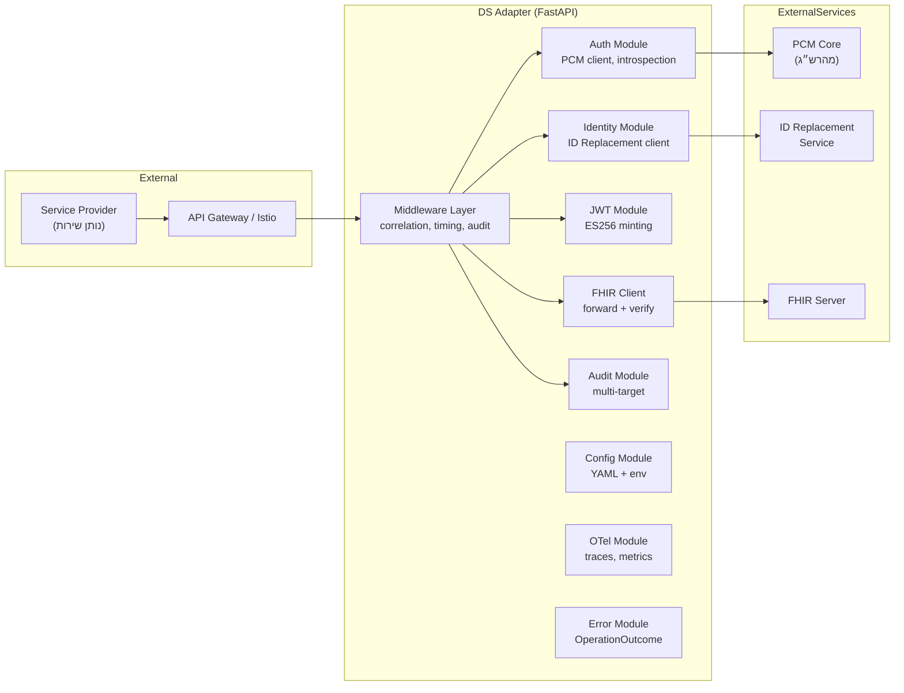
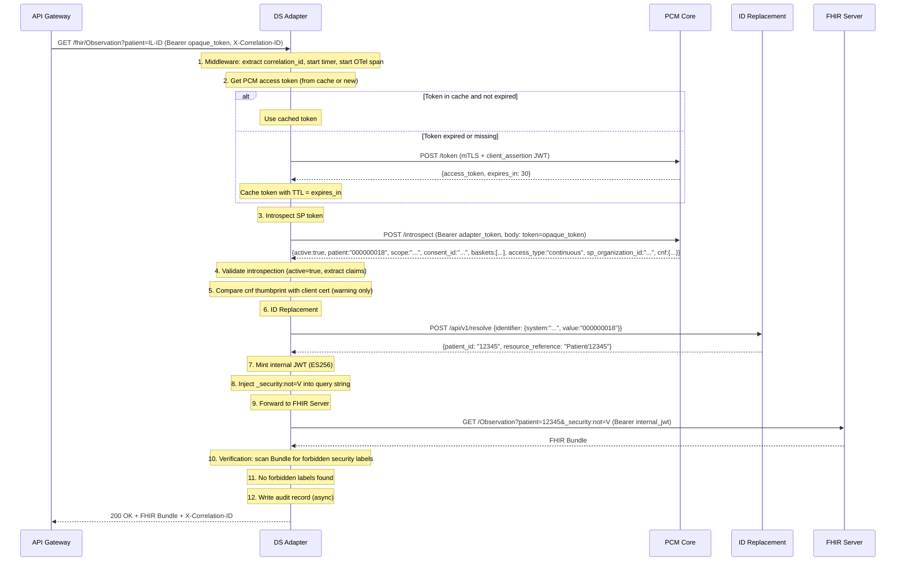
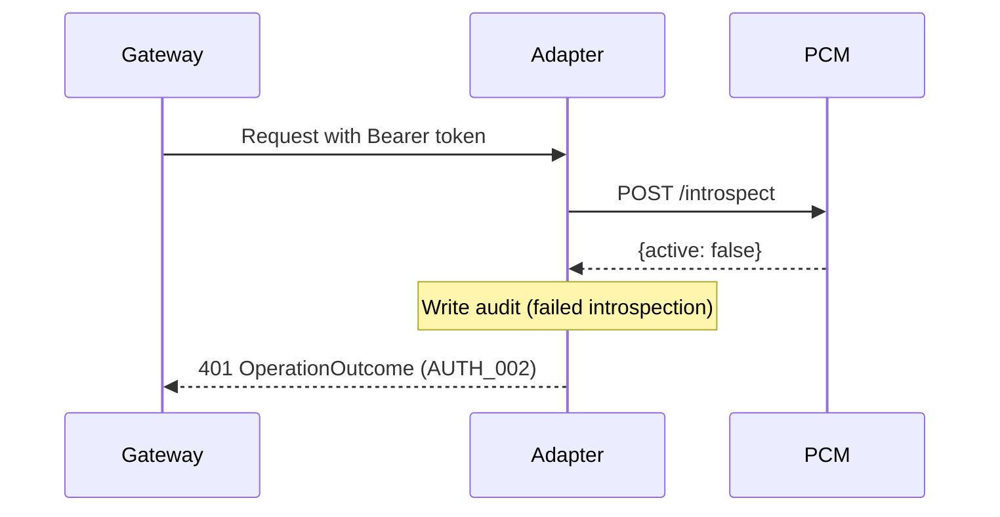
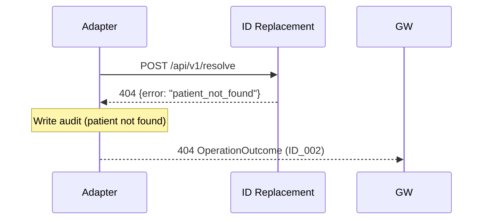
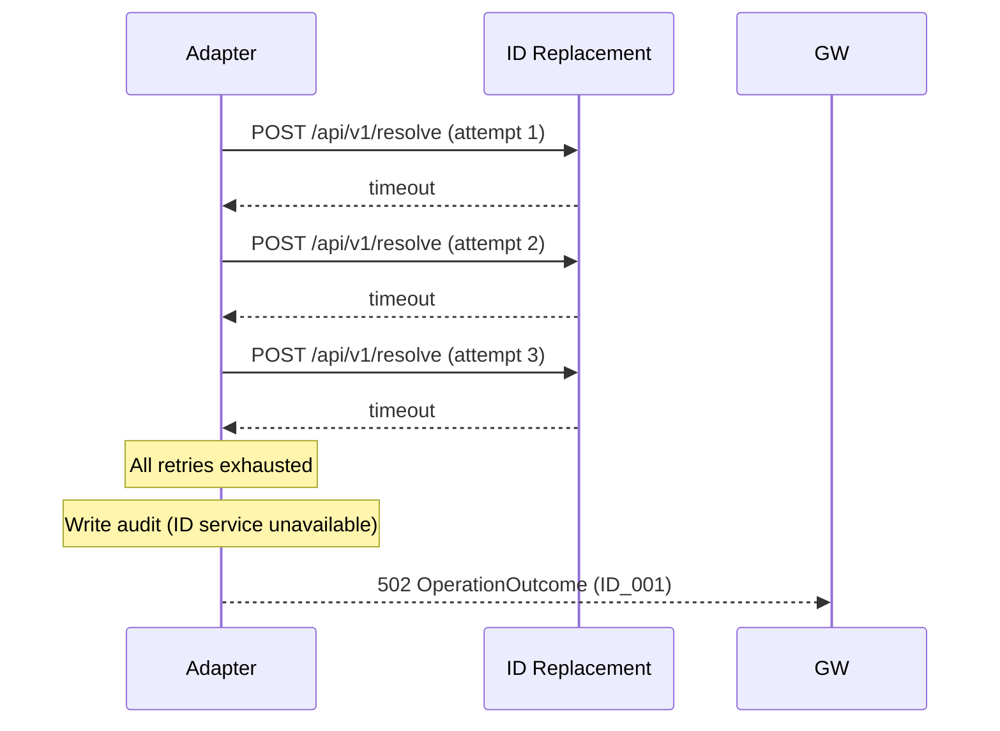
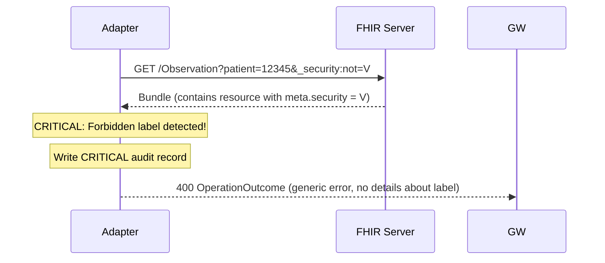

# מסמך עיצוב מפורט — Data Source Adapter (Python / FastAPI)

## 1. סקירת ארכיטקטורה

### 1.1 דיאגרמת רכיבים



### 1.2 Request Flow — Sequence Diagram (Happy Path)



### 1.3 Error Flows

#### Token Introspection Failed (inactive)


#### ID Replacement — Patient Not Found


#### ID Replacement — Service Unavailable (after retries)


#### Verification — Forbidden Label Found


---

## 2. Data Models (Pydantic)

### 2.1 Configuration Models

```python
from pydantic import BaseModel, Field
from typing import Optional, Literal
from enum import Enum


class ServerConfig(BaseModel):
    host: str = "0.0.0.0"
    port: int = 8000
    shutdown_timeout_seconds: int = 30


class PCMConfig(BaseModel):
    base_url: str  # e.g. "https://pcm-core:3000"
    token_endpoint: str = "/token"
    introspect_endpoint: str = "/introspect"
    token_scope: str = "system/*.crus"
    mtls_client: bool = True  # True = adapter does mTLS, False = external layer


class FHIRServerConfig(BaseModel):
    base_url: str  # e.g. "https://fhir-internal:8080"
    protocol: Literal["http", "https"] = "https"
    timeout_seconds: int = 30


class IDReplacementConfig(BaseModel):
    base_url: str  # e.g. "http://id-service:9000"
    endpoint: str = "/api/v1/resolve"
    timeout_seconds: float = 1.0
    retries: int = 3
    retry_backoff_seconds: float = 0.5


class JWTConfig(BaseModel):
    algorithm: str = "ES256"
    issuer: str = "ds-adapter"
    expiry_seconds: int = 300


class SyslogTarget(BaseModel):
    enabled: bool = False
    host: str = "localhost"
    port: int = 514
    protocol: Literal["udp", "tcp"] = "udp"


class FileTarget(BaseModel):
    enabled: bool = True
    path: str = "/var/log/adapter/audit.log"
    rotation: Literal["daily", "hourly"] = "daily"
    max_files: int = 30


class KafkaTarget(BaseModel):
    enabled: bool = False
    brokers: str = "kafka:9092"
    topic: str = "ds-adapter-audit"


class AuditTargets(BaseModel):
    syslog: SyslogTarget = SyslogTarget()
    file: FileTarget = FileTarget()
    kafka: KafkaTarget = KafkaTarget()


class AuditConfig(BaseModel):
    enabled: bool = True
    format: Literal["json", "cef"] = "json"
    include_response: bool = False
    targets: AuditTargets = AuditTargets()


class LoggingConfig(BaseModel):
    level: Literal["debug", "info", "warning", "error"] = "info"
    format: Literal["json"] = "json"


class OTelConfig(BaseModel):
    enabled: bool = True
    exporter: Literal["otlp", "jaeger", "zipkin", "console"] = "otlp"
    endpoint: str = "http://otel-collector:4317"
    service_name: str = "ds-adapter"
    sample_rate: float = 1.0


class VerificationConfig(BaseModel):
    enabled: bool = True
    forbidden_labels: list[str] = [
        "http://fhir.health.gov.il/cs/il-core-main-security-label|V"
    ]


class AppConfig(BaseModel):
    server: ServerConfig = ServerConfig()
    pcm: PCMConfig
    fhir_server: FHIRServerConfig
    id_replacement: IDReplacementConfig
    jwt: JWTConfig = JWTConfig()
    audit: AuditConfig = AuditConfig()
    logging: LoggingConfig = LoggingConfig()
    otel: OTelConfig = OTelConfig()
    verification: VerificationConfig = VerificationConfig()
```

### 2.2 Domain Models

```python
from pydantic import BaseModel, Field
from typing import Optional
from datetime import datetime


# --- PCM Token Response ---
class PCMTokenResponse(BaseModel):
    access_token: str
    token_type: str = "Bearer"
    expires_in: int  # seconds


# --- Introspection Response ---
class BasketInfo(BaseModel):
    code: str  # e.g. "laboratoryTests"
    system: str  # e.g. "http://fhir.health.gov.il/cs/hdp-information-buckets"
    historical_depth: str  # ISO date, e.g. "2024-01-01"


class CnfClaim(BaseModel):
    x5t_S256: Optional[str] = Field(None, alias="x5t#S256")  # cert thumbprint


class IntrospectionResponse(BaseModel):
    active: bool
    patient: Optional[str] = None  # national patient ID
    scope: Optional[str] = None  # FHIR scopes
    consent_id: Optional[str] = None
    baskets: Optional[list[BasketInfo]] = None
    access_type: Optional[str] = None  # "continuous" | "one-time"
    sp_organization_id: Optional[str] = None
    cnf: Optional[CnfClaim] = None
    exp: Optional[int] = None  # expiration timestamp


# --- ID Replacement ---
class NationalId(BaseModel):
    system: str  # "http://fhir.health.gov.il/identifier/il-national-id"
    value: str  # e.g. "000000018"


class IDReplacementRequest(BaseModel):
    identifier: NationalId


class IDReplacementResponse(BaseModel):
    patient_id: str  # local patient ID
    resource_reference: str  # "Patient/12345"


class IDReplacementError(BaseModel):
    error: str  # "patient_not_found" | "service_unavailable"
    message: str


# --- Internal JWT Claims ---
class InternalJWTPayload(BaseModel):
    iss: str  # "ds-adapter"
    sub: str  # local_patient_id
    aud: str  # fhir_server_base_url
    exp: int  # expiration timestamp
    iat: int  # issued at timestamp
    consent_id: str
    scope: str  # FHIR scopes
    patient: str  # local_patient_id
    baskets: list[BasketInfo]
    access_type: str  # "continuous" | "one-time"
    sp_organization_id: str
    correlation_id: str


# --- Audit Record ---
class AuditRecord(BaseModel):
    timestamp: str  # ISO 8601
    correlation_id: str
    source_ip: str
    method: str  # HTTP method
    path: str  # request path
    fhir_scope: Optional[str] = None
    patient_id: Optional[str] = None  # masked
    sp_organization_id: Optional[str] = None
    consent_id: Optional[str] = None
    response_status: int
    response_time_ms: float
    response_body: Optional[str] = None  # disabled by default
    error: Optional[str] = None  # error details if applicable


# --- FHIR OperationOutcome ---
class ErrorCoding(BaseModel):
    system: str = "http://ds-adapter/error-codes"
    code: str  # e.g. "AUTH_002"
    display: str


class ErrorDetails(BaseModel):
    coding: list[ErrorCoding]


class OperationOutcomeIssue(BaseModel):
    severity: str = "error"
    code: str  # FHIR issue type: "login", "forbidden", "not-found", "exception", "timeout"
    details: ErrorDetails
    diagnostics: str  # human-readable (no internal details)


class OperationOutcome(BaseModel):
    resourceType: str = "OperationOutcome"
    issue: list[OperationOutcomeIssue]
```

### 2.3 Token Cache Model

```python
from dataclasses import dataclass
from time import time


@dataclass
class CachedToken:
    access_token: str
    expires_at: float  # unix timestamp

    @property
    def is_expired(self) -> bool:
        return time() >= self.expires_at

    @classmethod
    def from_response(cls, response: PCMTokenResponse) -> "CachedToken":
        return cls(
            access_token=response.access_token,
            expires_at=time() + response.expires_in
        )
```

---

## 3. Business Rules Matrix

### 3.1 Error Decision Table

| תרחיש | HTTP Status | Error Code | Issue Code | הערה |
|--------|-------------|------------|------------|------|
| Bearer token חסר או לא תקין | 401 | AUTH_001 | login | |
| Introspection: active=false | 401 | AUTH_002 | login | |
| Token expired (exp < now) | 401 | AUTH_003 | login | |
| Consent לא תקף ל-resource המבוקש | 403 | AUTH_004 | forbidden | |
| cnf mismatch (blocking mode) | 403 | AUTH_005 | forbidden | **כרגע warning בלבד** |
| ID Replacement service unavailable | 502 | ID_001 | exception | אחרי כל ה-retries |
| Patient not found | 404 | ID_002 | not-found | |
| FHIR Server unavailable | 502 | FHIR_001 | exception | |
| FHIR Server timeout | 504 | FHIR_002 | timeout | |
| PCM unreachable | 502 | PCM_001 | exception | |
| Failed to acquire PCM token | 401 | PCM_002 | login | |
| Configuration error | 500 | CFG_001 | exception | |
| Unexpected error | 500 | GEN_001 | exception | |
| Forbidden security label in response | 400 | — | — | Generic OperationOutcome, no error code exposed |

### 3.2 cnf Comparison Rules

| מצב | פעולה |
|------|-------|
| cnf claim קיים ב-introspection + client cert קיים | השוואת SHA-256 thumbprint |
| Thumbprints תואמים | ממשיך רגיל |
| Thumbprints לא תואמים | **WARNING log בלבד** — לא חוסם |
| cnf claim חסר | ממשיך רגיל (לא כל ה-tokens כוללים cnf) |
| Client cert חסר (no mTLS) | ממשיך רגיל (mTLS מנוהל ע"י gateway) |

### 3.3 Security Parameter Injection Rules

| HTTP Method | Path Pattern | הזרקת `_security:not=V` |
|-------------|-------------|--------------------------|
| GET | /fhir/* (search/read) | **כן** |
| POST | /fhir/*/_search | **כן** (POST-based search) |
| POST | /fhir/* (create) | **לא** |
| PUT | /fhir/* (update) | **לא** |
| DELETE | /fhir/* (delete) | **לא** |
| PATCH | /fhir/* (patch) | **לא** |

### 3.4 Verification Rules

| בדיקה | פעולה |
|--------|-------|
| Response הוא FHIR Bundle | סריקת כל entry.resource.meta.security |
| Response הוא Resource בודד | סריקת resource.meta.security |
| נמצאה תגית מרשימת forbidden_labels | STOP → audit CRITICAL → return 400 |
| לא נמצאו תגיות אסורות | העברת response ל-caller |
| verification.enabled = false | דילוג על הבדיקה (development mode) |

---

## 4. API Contract

### 4.1 External API (via Gateway)

```yaml
# Simplified OpenAPI structure
paths:
  /fhir/{resource_type}:
    get:
      summary: FHIR Search/Read
      parameters:
        - name: resource_type
          in: path
          required: true
          schema:
            type: string
        - name: Authorization
          in: header
          required: true
          schema:
            type: string
            pattern: "^Bearer .+$"
        - name: X-Correlation-ID
          in: header
          required: false
          schema:
            type: string
            format: uuid
      responses:
        200:
          description: FHIR Bundle or Resource
        400:
          description: Forbidden content detected (OperationOutcome)
        401:
          description: Authentication failed (OperationOutcome)
        403:
          description: Authorization failed (OperationOutcome)
        404:
          description: Patient not found (OperationOutcome)
        502:
          description: Upstream service error (OperationOutcome)
        504:
          description: Upstream timeout (OperationOutcome)
```

### 4.2 Internal APIs

```yaml
paths:
  /health:
    get:
      summary: Liveness probe
      responses:
        200:
          content:
            application/json:
              schema:
                type: object
                properties:
                  status:
                    type: string
                    enum: [ok]

  /ready:
    get:
      summary: Readiness probe
      responses:
        200:
          content:
            application/json:
              schema:
                type: object
                properties:
                  status:
                    type: string
                    enum: [ready, not_ready]
                  fhir_server:
                    type: string
                    enum: [ok, error]
                  pcm:
                    type: string
                    enum: [ok, error]

  /metrics:
    get:
      summary: Prometheus metrics
      responses:
        200:
          content:
            text/plain:
              schema:
                type: string
```

### 4.3 ID Replacement Contract (Template)

```yaml
paths:
  /api/v1/resolve:
    post:
      summary: Resolve national ID to local patient ID
      requestBody:
        content:
          application/json:
            schema:
              type: object
              required: [identifier]
              properties:
                identifier:
                  type: object
                  required: [system, value]
                  properties:
                    system:
                      type: string
                      example: "http://fhir.health.gov.il/identifier/il-national-id"
                    value:
                      type: string
                      example: "000000018"
      responses:
        200:
          content:
            application/json:
              schema:
                type: object
                properties:
                  patient_id:
                    type: string
                  resource_reference:
                    type: string
                    example: "Patient/12345"
        404:
          content:
            application/json:
              schema:
                type: object
                properties:
                  error:
                    type: string
                    enum: [patient_not_found]
                  message:
                    type: string
        503:
          content:
            application/json:
              schema:
                type: object
                properties:
                  error:
                    type: string
                    enum: [service_unavailable]
                  message:
                    type: string
```

---

## 5. Configuration File (config.yaml)

```yaml
server:
  host: "0.0.0.0"
  port: 8000
  shutdown_timeout_seconds: 30

pcm:
  base_url: "https://pcm-core:3000"
  token_endpoint: "/token"
  introspect_endpoint: "/introspect"
  mtls_client: true

fhir_server:
  base_url: "https://fhir-internal:8080"
  protocol: "https"
  timeout_seconds: 30

id_replacement:
  base_url: "http://id-service:9000"
  endpoint: "/api/v1/resolve"
  timeout_seconds: 1.0
  retries: 3
  retry_backoff_seconds: 0.5

jwt:
  algorithm: "ES256"
  issuer: "ds-adapter"
  expiry_seconds: 300

audit:
  enabled: true
  format: "json"
  include_response: false
  targets:
    syslog:
      enabled: false
      host: "localhost"
      port: 514
      protocol: "udp"
    file:
      enabled: true
      path: "/var/log/adapter/audit.log"
      rotation: "daily"
      max_files: 30
    kafka:
      enabled: false
      brokers: "kafka:9092"
      topic: "ds-adapter-audit"

logging:
  level: "info"
  format: "json"

otel:
  enabled: true
  exporter: "otlp"
  endpoint: "http://otel-collector:4317"
  service_name: "ds-adapter"
  sample_rate: 1.0

verification:
  enabled: true
  forbidden_labels:
    - "http://fhir.health.gov.il/cs/il-core-main-security-label|V"
```

### Environment Variables (Secrets)

```bash
# mTLS certificates for PCM communication
DS_ADAPTER_PCM_CLIENT_CERT=<PEM encoded client certificate>
DS_ADAPTER_PCM_CLIENT_KEY=<PEM encoded private key>
DS_ADAPTER_PCM_CA_CERT=<PEM encoded CA certificate>

# JWT signing key
DS_ADAPTER_JWT_SIGNING_KEY=<PEM encoded ES256 private key>

# ID Replacement auth (optional, org-specific)
DS_ADAPTER_ID_REPLACEMENT_AUTH=<credentials as defined by org>
```

---

## 6. Module Responsibilities

| Module | קובץ | אחריות |
|--------|-------|---------|
| Config | `src/config/settings.py` | טעינת YAML + env override, validation עם Pydantic |
| Correlation | `src/middleware/correlation.py` | חילוץ/יצירת X-Correlation-ID, הזרקה ל-context |
| Timing | `src/middleware/timing.py` | מדידת response time |
| Audit MW | `src/middleware/audit_middleware.py` | לכידת request/response לצורך audit |
| PCM Client | `src/auth/pcm_client.py` | Token acquisition (cache), introspection |
| mTLS | `src/auth/mtls.py` | ניהול HTTPS session עם client cert |
| JWT Service | `src/auth/jwt_service.py` | יצירת JWT פנימי (ES256) |
| ID Replacement | `src/identity/id_replacement.py` | קריאה לשירות חיצוני עם retry |
| FHIR Client | `src/fhir/client.py` | העברת בקשה ל-FHIR Server |
| Verification | `src/fhir/verification.py` | סריקת Bundle לתגיות אסורות |
| Audit Service | `src/audit/service.py` | אורקסטרציה — שליחה לכל targets |
| Audit Targets | `src/audit/targets/` | Syslog, File, Kafka implementations |
| Error Catalog | `src/errors/catalog.py` | הגדרת error codes |
| Error Handlers | `src/errors/handlers.py` | Global exception handlers |
| OO Builder | `src/errors/models.py` | בניית OperationOutcome |
| OTel Setup | `src/otel/setup.py` | אתחול OpenTelemetry |
| Logging | `src/logging/setup.py` | הגדרת structlog |
| Routes | `src/api/routes.py` | FHIR proxy routes + health/ready/metrics |
| Dependencies | `src/api/dependencies.py` | FastAPI DI — auth, correlation |

---

## 7. Key Implementation Notes

### 7.1 Token Cache
- שמירה ב-module-level variable (single instance, stateless between restarts)
- Thread-safe: שימוש ב-asyncio.Lock
- TTL = `expires_in` מהתשובה (לא hardcoded)

### 7.2 mTLS Modes
- `mtls_client: true` → httpx client עם `cert=(cert_path, key_path)` ו-`verify=ca_path`
- `mtls_client: false` → httpx client רגיל (plain HTTPS or HTTP)

### 7.3 Retry Logic (ID Replacement)
- Exponential backoff: `backoff * (2 ** attempt)`
- Retry on: timeout, 5xx responses
- No retry on: 4xx responses (client errors)

### 7.4 Audit Async
- Kafka: fire-and-forget (לא חוסם)
- File: async write
- Syslog: async send
- **Audit failure must not fail the request**

### 7.5 Graceful Shutdown
1. Stop accepting new connections
2. Wait for in-flight requests (up to `shutdown_timeout_seconds`)
3. Flush audit buffers
4. Exit 0

---

## 8. Test Scenarios

### Unit Tests
| Module | Test Case |
|--------|-----------|
| pcm_client | Token acquisition — success |
| pcm_client | Token acquisition — PCM unreachable |
| pcm_client | Token cache — returns cached when valid |
| pcm_client | Token cache — refreshes when expired |
| pcm_client | Introspection — active token |
| pcm_client | Introspection — inactive token |
| jwt_service | Mint JWT — correct claims |
| jwt_service | Mint JWT — correct ES256 signature |
| id_replacement | Resolve — success |
| id_replacement | Resolve — patient not found (404) |
| id_replacement | Resolve — timeout + retry |
| id_replacement | Resolve — all retries exhausted |
| verification | Bundle without forbidden labels — pass |
| verification | Bundle with V label — fail |
| verification | Single resource with V label — fail |
| verification | Disabled verification — skip |
| error_handlers | Each error code → correct OperationOutcome |
| correlation | Extract from header |
| correlation | Generate when missing |
| config | YAML loading |
| config | Env var override |

### Integration Tests (with mocks)
| Flow | Description |
|------|-------------|
| Happy path | Full flow: token → introspect → ID → JWT → FHIR → verify → response |
| Auth failure | Inactive token → 401 |
| Patient not found | ID replacement 404 → 404 |
| FHIR timeout | FHIR server timeout → 504 |
| Forbidden label | V label in response → 400 |
| PCM down | PCM unreachable → 502 |
| Correlation propagation | Verify correlation_id flows through all calls |
