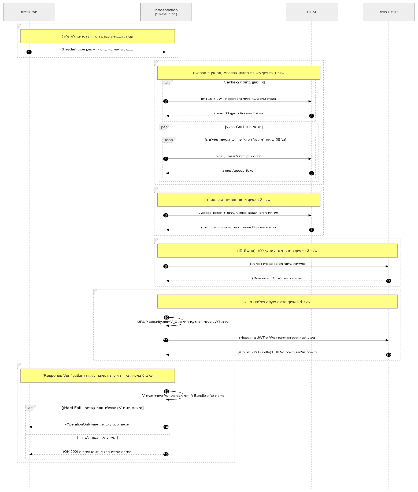

אפיון תהליך מקור מידע מול PCM

כותבים: שניר ארליך, אמיר לוי, תומר לניאדו

Table of Contents

[תרשים זרימת מידע Sequence Diagram](#תרשים-זרימת-מידע-sequence-diagram)

[רכיב 1: Manage Access Token (ניהול טוקן גישה מול PCM)](#רכיב-1-manage-access-token-ניהול-טוקן-גישה-מול-pcm)

[1. מטרת הרכיב](#1-מטרת-הרכיב)

[2. דרישות עסקיות ותהליכיות](#2-דרישות-עסקיות-ותהליכיות)

[3. מפרט טכני של הממשק (Request / Response)](#3-מפרט-טכני-של-הממשק-request--response)

[פירוט שדות הבקשה (Request)](#פירוט-שדות-הבקשה-request)

[פירוט שדות התשובה (Response)](#פירוט-שדות-התשובה-response)

[רכיב 2: Open Identifier Token (Introspection)](#רכיב-2-open-identifier-token-introspection)

[פירוט שדות הבקשה (Request ל-PCM)](#פירוט-שדות-הבקשה-request-ל-pcm)

[פירוט שדות התשובה (Response מה-PCM)](#פירוט-שדות-התשובה-response-מה-pcm)

[רכיב 3: ID Swap (המרת מזהה מטופל ל-Resource ID)](#רכיב-3-id-swap-המרת-מזהה-מטופל-ל-resource-id)

[פירוט שדות הבקשה (Request - קלט לרכיב)](#פירוט-שדות-הבקשה-request---קלט-לרכיב)

[פירוט שדות התשובה (Response - פלט מהרכיב)](#פירוט-שדות-התשובה-response---פלט-מהרכיב)

[רכיב 4: Create JWT & Request (יצירת בקשה לשרת ה-FHIR)](#רכיב-4-create-jwt--request-יצירת-בקשה-לשרת-ה-fhir)

[א. שדות קלט (Inputs)](#א-שדות-קלט-inputs)

[ב. מבנה ה-JWT (Payload Claims)](#ב-מבנה-ה-jwt-payload-claims)

[ג. תוצר סופי: הבקשה המוזרקת (The Final Request)](#ג-תוצר-סופי-הבקשה-המוזרקת-the-final-request)

[רכיב 5: Response Verification (אימות ובקרת איכות התשובה)](#רכיב-5-response-verification-אימות-ובקרת-איכות-התשובה)

[3. מפרט טכני של הלוגיקה](#3-מפרט-טכני-של-הלוגיקה)

[א. קלט לרכיב (Input)](#א-קלט-לרכיב-input)

[ב. תהליך הבדיקה (The Verification Loop)](#ב-תהליך-הבדיקה-the-verification-loop)

[ג. פלט מהרכיב (Output)](#ג-פלט-מהרכיב-output)

# תרשים זרימת מידע Sequence Diagram

# רכיב 1: Manage Access Token (ניהול טוקן גישה מול PCM)

## 1. מטרת הרכיב

ייצור ותחזוקה של טוקן גישה (Access Token) המשמש את "מקור המידע" להזדהות מול שרתי ה-PCM. טוקן זה נדרש עבור כל קריאת API פנימית מול ה-PCM (כגון פנייה ל-Introspection לפתיחת טוקן אטום).

## 2. דרישות עסקיות ותהליכיות

* **תשתית תקשורת:** הקריאה ל-PCM חייבת להתבצע על גבי תשתית **mTLS**, תוך שימוש בתעודה הדיגיטלית של הארגון (המונפקת מול מערכת NTN).
* **חתימה (Client Assertion):** על מקור המידע לייצר מסר JWT ולחתום עליו באמצעות המפתח הפרטי שלו. ה-PCM יאמת את החתימה מול המפתח הציבורי של הארגון.
* **ניהול מחזור חיים (Cache) – אופטימיזציה לביצועים**: תוקף הטוקן שחוזר מה-PCM הוא ל-30 שניות בלבד. הרכיב נדרש לנהל מנגנון Cache. חידוש הטוקן מול ה-PCM יתבצע בצורה יזומה (למשל, כל 25 שניות) אך ורק אם קיימות בקשות פעילות או נכנסות מנותני שירות. במידה ואין לרכיב בקשות הממתינות לטיפול (מצב Idle), הוא לא יפנה ל-PCM לבקש טוקן חדש עד שתגיע דרישה חדשה.

## 3. מפרט טכני של הממשק (Request / Response)

**סוג בקשה:** POST

**פורמט נתונים:** application/x-www-form-urlencoded

### פירוט שדות הבקשה (Request)

|  |  |  |  |
| --- | --- | --- | --- |
| שם שדה (Field) | חובה (Required) | תיאור (Description) | ערך מצופה / הערות |
| grant\_type | **כן** | מציין את סוג ההרשאה המבוקשת. | תמיד יכיל את הערך: client\_credentials |
| client\_assertion\_type | **כן** | מציין כי ההזדהות מבוצעת באמצעות JWT. | הערך הקבוע יהיה: urn:ietf:params:oauth:client-assertion-type:jwt-bearer |
| client\_assertion | **כן** | מסר חתום (JWT) שנוצר ונחתם על ידי מקור המידע. | חייב לכלול את ה-claims הבאים: iss, sub, aud, iat, exp, jti. חתום במפתח הפרטי. |
| scope | **לא** | תחום ההרשאות המבוקש מה-PCM. | אופציונלי. יכול להיות ריק או להכיל ערכים כגון fhir.read בהתאם לצורך. |

### פירוט שדות התשובה (Response)

התשובה תחזור בפורמט **JSON**.

|  |  |  |
| --- | --- | --- |
| שם שדה (Field) | חובה (Required) | תיאור (Description) |
| access\_token | **כן** | טוקן הגישה שהונפק בהצלחה על ידי ה-PCM עבור מקור המידע. זהו הטוקן שיש לשמור ב-Cache ולשלוח ב-Header (כ-Bearer) בבקשות הבאות. |
| token\_type | **כן** | סוג הטוקן. |
| expires\_in | **כן** | זמן פקיעת תוקף הטוקן בשניות. |

# רכיב 2: Open Identifier Token (Introspection)

## 1. מטרת הרכיב

אימות ופתיחת טוקן (Introspection) שנמסר למקור המידע על ידי נותן השירות. הרכיב מקבל את הטוקן האטום, שולח אותו ל-PCM (תוך הזדהות עם הטוקן מהרכיב הראשון), ומקבל בתמורה פירוט מלא של הרשאות הגישה, פרטי המטופל ופרטי נותן השירות.

## 2. דרישות עסקיות ותהליכיות

* **תמיכה ב-Cache של טוקן פתוח:** על מנת להפחית עומסים ולשפר זמני תגובה, על הרכיב לנהל מטמון (Cache) גם עבור הטוקנים הפתוחים. אם נותן שירות פונה שוב עם אותו טוקן אטום, וטרם פג תוקפו של הטוקן (לפי ה-exp שהתקבל), אין צורך לפנות ל-PCM בשנית לפתיחתו.

## 3. מפרט טכני של הממשק (Request / Response)

### פירוט שדות הבקשה (Request ל-PCM)

|  |  |  |
| --- | --- | --- |
| שם שדה (Field) | חובה (Required) | תיאור (Description) |
| Authorization | **כן** | (Header) טוקן ההזדהות של מקור המידע עצמו (ה-access\_token שהתקבל בממשק הרכיב הראשון - manage\_access\_token). נשלח בפורמט Bearer. |
| token | **כן** | (Body) ה-Access Token (האטום) שנמסר למקור המידע על ידי נותן השירות, ואותו מבקשים מה-PCM לפתוח ולאמת. |

### פירוט שדות התשובה (Response מה-PCM)

התשובה חוזרת בפורמט **JSON** ותכיל את הנתונים הנדרשים להמשך התהליך:

|  |  |  |
| --- | --- | --- |
| שם שדה (Field) | חובה (Required) | תיאור (Description) |
| active | **כן** | שדה בוליאני המציין האם הטוקן תקין ובתוקף. אם הסטטוס הוא false, התהליך נעצר ויש להחזיר שגיאה לנותן השירות. |
| patient | **לא** | המזהה העסקי של המטופל (תעודת זהות או דרכון). מזהה זה יועבר לרכיב הבא (id\_swap) לצורך תרגום למזהה לוגי. |
| scope | **לא** | **השדה הקריטי לאכיפה:** מכיל את ההרשאות המדויקות שניתנו. ההרשאות יגיעו מנוסחות כשאילתות FHIR מוכנות (כולל סוגי משאבים, תגיות סלי מידע \_security, הגבלות תאריכים ועוד). |
| client\_id | **לא** | מזהה הארגון (ח.פ/מספר מזהה) של נותן השירות שפנה לבקש את המידע. |
| intent | **לא** | הפניה (Reference) לשירות הרפואי הספציפי שעבורו ניתנה הסכמת המטופל. |
| aud, iss, iat, exp, jti | **לא** | מטה-דאטה טכני הכולל את קהל היעד (השרת שלכם), מנפיק הטוקן (PCM), זמן ההנפקה, זמן התפוגה (קריטי לניהול ה-Cache) ומזהה חד-ערכי לטוקן. |

# רכיב 3: ID Swap (המרת מזהה מטופל ל-Resource ID)

## 1. מטרת הרכיב

רכיב זה משמש כגשר בין העולם העסקי לעולם ה-FHIR הפנימי של הארגון. הוא מקבל את המזהה העסקי של המטופל (כפי שהתקבל מה-PCM בשלב הקודם) ומתרגם אותו למזהה הלוגי (Resource ID) המשמש את שרת ה-FHIR הפנימי לשליפת הרשומות הרפואיות.

## 2. דרישות עסקיות ותהליכיות

* **תבנית שאילתה (Template):** הרכיב נדרש להגדיר ולהחזיק תבנית (Template) לשאילתת FHIR שאיתה הוא יפנה לשרת ה-FHIR כדי לבצע את ההמרה (למשל, חיפוש משאב Patient לפי תעודת זהות).
* **ניהול תצורות (Config):** הרכיב צריך להחזיק ב-Config את פרטי ההתחברות לשרת ה-FHIR (Endpoint URL, הרשאות/חיבורים וכו').
* מנגנון זה יפותח כ- service נפרד מחבילת הרכיבים לטובת תמיכה של שיטות המרה שונות בין ארגונים

## 3. מפרט טכני של הממשק הפנימי (Request / Response)

### פירוט שדות הבקשה (Request - קלט לרכיב)

|  |  |  |
| --- | --- | --- |
| שם שדה (Field) | חובה (Required) | תיאור (Description) |
| patient\_identifier | **כן** | המזהה העסקי של המטופל (לדוגמה, תעודת זהות או דרכון) כפי שהתקבל מרכיב ה-open\_identifier\_token. |
| system | **כן** | מערכת הזיהוי של המזהה העסקי (למשל, ה-URI המייצג תעודות זהות ישראליות ב-FHIR IL Core). |

### פירוט שדות התשובה (Response - פלט מהרכיב)

|  |  |  |
| --- | --- | --- |
| שם שדה (Field) | חובה (Required) | תיאור (Description) |
| resource\_id | **כן** | המזהה הלוגי של המטופל (ה-ID הפנימי בשרת ה-FHIR). מזהה זה ישמש בהמשך לבניית שאילתות שליפת המידע. |

# רכיב 4: Create JWT & Request (יצירת בקשה לשרת ה-FHIR)

## 1. מטרת הרכיב

הרכבת ה-Request הסופי לשרת ה-FHIR הפנימי. הרכיב מייצר JWT חתום המכיל את הרשאות המטופל (Scopes) והמזהה הלוגי שלו, ובמקביל מעדכן את שאילתת ה-URL המקורית כך שתחריג באופן אוטומטי מידע חסוי ביותר (תגית V).

## 2. דרישות עסקיות ותהליכיות

* **החלפת מזהים:** הרכיב חייב להחליף את המזהה העסקי של המטופל (ת.ז) שהגיע מנותן השירות במזהה הלוגי (Resource ID) שהתקבל מרכיב ה-id\_swap.
* **הזרקת החרגת V (URL Injection):** על מנת למנוע שליפת מידע חסוי ביותר משרת ה FHIR (שכבת הגנה ראשונה), הרכיב ישרשר לכל שאילתת GET את הפרמטר:

&\_security:not=http://fhir.health.gov.il/cs/il-core-main-security-label|V

* **אוטומציה של Scopes:** הרכיב יטמיע בתוך ה-JWT את ה-Scopes המדויקים שהתקבלו מה-PCM כדי ששרת ה-FHIR יוכל לבצע אכיפה (Authorization) ברמת המשאב.

## 3. מפרט טכני של הממשק הפנימי

### א. שדות קלט (Inputs)

|  |  |  |
| --- | --- | --- |
| שם שדה | מקור | תיאור |
| original\_url | נותן השירות | שאילתת ה-FHIR המקורית שנשלחה (למשל: /Observation?category=vital-signs). |
| logical\_patient\_id | רכיב id\_swap | ה-ID הפנימי של המטופל בשרת ה-FHIR שלכם. |
| scopes\_list | רכיב introspection | רשימת ההרשאות המאושרות מה-PCM. |
| service\_provider\_id | רכיב introspection | מזהה נותן השירות (client\_id) לטובת שדה sub ב-JWT. |

### ב. מבנה ה-JWT (Payload Claims)

זהו הטוקן שיישלח ב-Header תחת Authorization: Bearer.

|  |  |  |
| --- | --- | --- |
| Claim | ערך מצופה | הסבר |
| iss | מזהה מקור המידע | הארגון שלכם (השרת המנפיק). |
| sub | service\_provider\_id | המזהה של נותן השירות שביקש את המידע. |
| aud | FHIR Server URL | כתובת שרת ה-FHIR הפנימי שלכם. |
| patient | logical\_patient\_id | **קריטי:** מקשר את הבקשה למטופל הספציפי. |
| scope | scopes\_list | מחרוזת ה-Scopes המקורית מה-PCM. |
| exp | iat + 60s | תוקף קצר מאוד לשימוש פנימי מיידי. |

### ג. תוצר סופי: הבקשה המוזרקת (The Final Request)

הבקשה שתישלח בפועל לשרת ה-FHIR תיראה כך:

GET [Internal\_FHIR\_URL]/[Resource]?[Params]&patient=[logical\_id]&\_security:not=V

# רכיב 5: Response Verification (אימות ובקרת איכות התשובה)

## 1. מטרת הרכיב

רכיב זה משמש כשכבת הגנה שנייה (Layer 2) המבצעת סריקה אקטיבית של המידע שחזר משרת ה-FHIR הפנימי. תפקידו לוודא באופן אבסולוטי ששום רשומה המתוייגת כחסויה ביותר (V) לא תצא אל נותן השירות. הרכיב מגן על הארגון מפני באגים בשרת ה-FHIR, טעויות בקידוד השאילתה או זליגת מידע לא צפויה.

## 2. דרישות עסקיות ותהליכיות

* **סריקה מלאה:** הרכיב יסרוק כל משאב (Resource) בתוך ה-Bundle שחזר מהשרת לפני העברתו לנותן השירות.
* **הכשלת מסר קשיחה (Hard Fail):** במידה ונמצאה ולו רשומה אחת הכוללת תגית אבטחה אסורה, המסר כולו ייפסל ולא יישלח ללקוח.
* **עמידות בפרטיות:** נותן השירות יקבל הודעת שגיאה טכנית כללית. אסור לחשוף בפניו כי הסיבה לשגיאה היא קיומו של מידע חסוי ביותר לגבי המטופל.
* **ניהול רשימת חסימות (Config):** הרכיב יחזיק רשימה של תגיות אסורות ב-Config (למשל תגיות סלי מידע חסויים או רגישים), כאשר תגית V היא תגית חובה לחסימה.
* הוספת Flag להפעלה או כיבוי של הרכיב

## 3. מפרט טכני של הלוגיקה

### א. קלט לרכיב (Input)

* **FHIR Bundle:** התשובה הגולמית שחזרה משרת ה-FHIR הפנימי בעקבות השאילתה מרכיב 4.
* **Forbidden Tags List:** רשימת ערכים מה-Config (לדוגמה: http://fhir.health.gov.il/cs/il-core-main-security-label|V).

### ב. תהליך הבדיקה (The Verification Loop)

1. פירוק ה-Bundle לכל ה-entries שבו.
2. עבור כל רשומה, בדיקת הנתיב: resource.meta.security.
3. בדיקה האם קיים coding שבו ה-system וה-code תואמים לתגית V (או תגיות אסורות אחרות ב-Config).
4. **תרחיש שגיאה (תגית V נמצאה):**
   * עצירת הזרמת הנתונים מיד.
   * יצירת לוג קריטי פנימי (Audit Log) הכולל: מזהה מטופל (4 ספרות אחרונות בלבד), זמן, ותיאור התקלה ("זיהוי מידע חסוי בתשובה").
   * החזרת תשובת OperationOutcome לנותן השירות עם קוד שגיאה כללי.
5. **תרחיש תקין (לא נמצאו תגיות אסורות):**
   * העברת ה-Bundle המקורי כפי שהוא לנותן השירות.

### ג. פלט מהרכיב (Output)

|  |  |  |
| --- | --- | --- |
| תרחיש | פלט לנותן השירות | סטטוס HTTP |
| תקין (המידע נקי) | ה-JSON Bundle המקורי | 200 OK |
| לא תקין (זיהוי V) | הודעת שגיאה כללית (OperationOutcome) | 400 |
