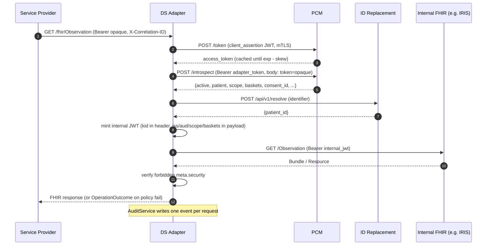
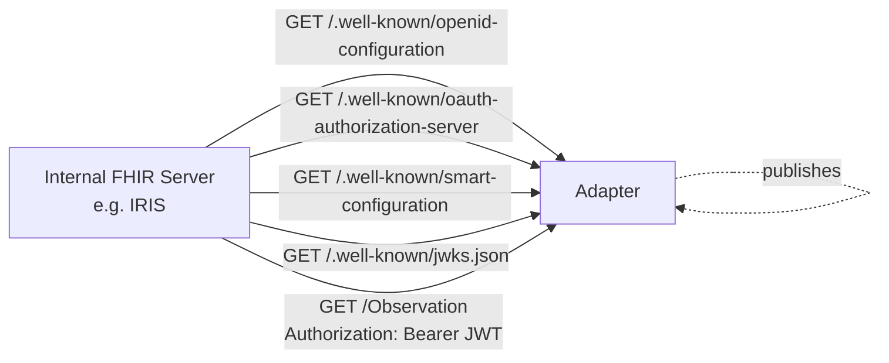
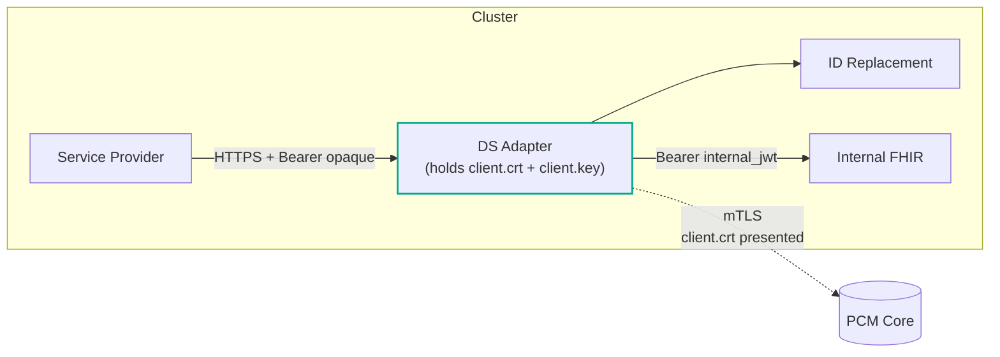
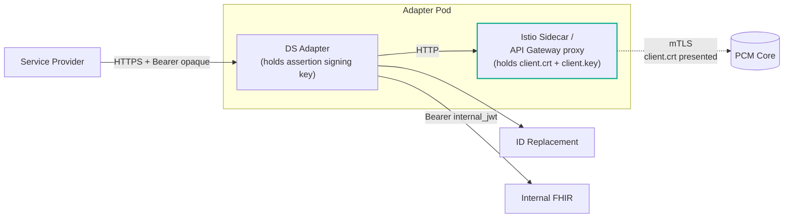
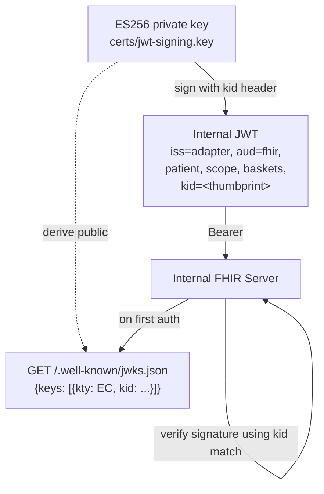

# DS Adapter — Architecture

The Data Source Adapter is a Policy Enforcement Point that sits between
external Service Providers and the organization's internal FHIR server.
It validates an opaque PCM bearer token, resolves the patient identifier
to a local FHIR id, mints a short-lived internal JWT, forwards the FHIR
request, verifies the response, and audits everything.

## Components

| Module | Responsibility |
|---|---|
| `src/api/routes.py` | FHIR R4 REST proxy entry point + `/.well-known/*` discovery + `/health` + `/ready` |
| `src/auth/pcm_client.py` | Acquires the adapter's PCM client token (client_credentials + JWT assertion) and introspects the SP opaque token |
| `src/auth/mtls.py` | Builds the httpx client used for PCM calls. mTLS or plain HTTP based on config |
| `src/auth/jwt_service.py` | Mints the internal JWT (ES256 by default) with `iss/aud/sub/patient/scope/baskets/...` |
| `src/auth/jwks.py` | Publishes the public key as a JWK set; computes the `kid` thumbprint |
| `src/auth/metadata.py` | Builds the `oauth-authorization-server`, `openid-configuration`, and `smart-configuration` discovery payloads |
| `src/identity/id_replacement.py` | Resolves national-id → local FHIR patient id |
| `src/fhir/client.py` | Forwards the request to the internal FHIR server with `Authorization: Bearer <internal_jwt>` |
| `src/fhir/verification.py` | Scans the FHIR response for forbidden `meta.security` labels |
| `src/audit/service.py` | Writes structured audit events |
| `src/observability/*` | Structured logs, Prometheus metrics, optional OTel tracing |

## High-Level Request Flow



## Discovery Surface (Adapter as Auth Server for IRIS)



The adapter exposes itself as the OAuth issuer that the FHIR server trusts.
The internal JWT carries a `kid` matching the JWK thumbprint advertised
at `/.well-known/jwks.json`. `jwt.issuer` MUST equal the URL the FHIR
server is configured to trust as `iss`. `jwt.audience` MUST equal one of
the audience values the FHIR server accepts. The audience is a logical
resource identifier, not necessarily the URL used for the network hop. For
example, an adapter may call an internal HTTP address while a gateway
originates TLS to the FHIR server; the JWT must still use the canonical HTTPS
audience configured at the FHIR server.

## mTLS Modes

The adapter supports two mTLS topologies for the PCM connection. Pick
based on where you want the certificate material to live and which team
owns rotation. Both modes are first-class.

### Mode A — Adapter terminates mTLS

The adapter holds the client cert/key and presents it directly to PCM.
Used when there is no service mesh between the adapter and PCM, or when
the adapter is the rightful owner of the data-source identity.

Set `pcm.mtls_client: true` (default).



Config (Python adapter):

```yaml
# config.yaml
pcm:
  base_url: "https://pcm.example.com:4501"
  mtls_client: true
  verify_hostname: true
  introspect_auth_method: "bearer"
```

```bash
# env
DS_ADAPTER_PCM_CLIENT_CERT=certs/client.crt
DS_ADAPTER_PCM_CLIENT_KEY=certs/client.key
DS_ADAPTER_PCM_CA_CERT=certs/rootCA.crt
```

The httpx client is built in `src/auth/mtls.py` with
`cert=(cert_path, key_path)` and `verify=<ca_path or SSLContext>`.

### Mode B — Sidecar / API Gateway terminates mTLS

A service mesh (Istio, Linkerd) or an API Gateway / egress proxy holds
the client cert and adds it on the way out. The adapter speaks plain
HTTP (or one-way TLS) to the sidecar and the sidecar handles mTLS to
PCM. Used when the cluster's security model centralizes certificate
material.

Set `pcm.mtls_client: false`.

Moving mTLS to an external component moves only the TLS handshake. It does
not remove application-level OAuth requirements. This adapter signs the PCM
`client_assertion` itself, so it still needs the private key associated with
its registered PCM client identity. The certificate may also be mounted with
the key when it is how that identity is distributed or validated, even though
the adapter does not present it during the externally terminated TLS
handshake. The gateway needs its own access to the certificate and private key
that it presents to PCM; these may represent the same registered identity,
subject to the PCM deployment's trust model.



Config:

```yaml
# config.yaml
pcm:
  base_url: "http://pcm-egress.svc.cluster.local"   # the sidecar address
  mtls_client: false
  introspect_auth_method: "bearer"
```

```bash
# env — TLS certificate handling is external, but OAuth signing remains local
DS_ADAPTER_PCM_CLIENT_KEY=certs/client.key
# DS_ADAPTER_PCM_CLIENT_CERT may also be mounted as registered identity material
# DS_ADAPTER_PCM_CA_CERT is not needed when the adapter does not establish TLS
```

In Istio, this is typically a `DestinationRule` with
`tls.mode: MUTUAL` plus a Secret holding the client material:

```yaml
apiVersion: networking.istio.io/v1
kind: DestinationRule
metadata:
  name: pcm-egress
spec:
  host: pcm-core.example.com
  trafficPolicy:
    tls:
      mode: MUTUAL
      clientCertificate: /etc/certs/pcm/tls.crt
      privateKey: /etc/certs/pcm/tls.key
      caCertificates: /etc/certs/pcm/ca.crt
      sni: pcm-core.example.com
```

Or with an API gateway (Kong, NGINX, AWS API Gateway), the same idea:
the gateway terminates the TLS to PCM with mTLS, and the adapter just
makes a plain HTTP call to the gateway.

### Picking a mode

| Question | Mode A | Mode B |
|---|---|---|
| Who owns cert rotation? | The adapter team | Platform / SRE |
| Is there a service mesh? | Optional | Required (or a gateway) |
| Adapter blast radius if cert leaks? | Adapter only | Whole pod / ns |
| Easier to debug TLS issues? | Yes (one process) | Slightly harder (mesh in the middle) |
| Multi-region/multi-cluster cert sharing? | Manual | Native to the mesh |

Both modes carry identical FHIR-side semantics. The adapter is
agnostic past the configuration switch. In both modes, distinguish the
transport credential used for the mTLS handshake from the private key used by
the adapter to sign its OAuth `client_assertion`. They can be based on the same
client identity, but they are used at different protocol layers.

## Inbound mTLS (Service Provider → Adapter)

Out of scope for the adapter itself. The recommended deployment puts an
ingress gateway in front of the adapter that terminates client mTLS or
verifies the SP's bearer token at the perimeter. The adapter trusts
`Authorization: Bearer` on its inbound interface and validates it via
PCM introspection. That introspection step is the actual authorization
check, not the TLS layer.

## Internal JWT — Cryptographic Trust



Key points:

- The signing key never leaves the adapter process.
- `kid` is the RFC 7638 JWK thumbprint, computed from the public key.
  The same value is embedded in the JWT header and published in the
  JWKS, so the FHIR server can pick the right key without trial.
- Rotating the key means generating a new key file, restarting the
  adapter, and waiting for any verifier-side JWKS cache to refresh.

## Failure Modes

| What fails | Adapter response | Error code |
|---|---|---|
| Missing/malformed Authorization | 401 OperationOutcome | `AUTH_001` |
| PCM `active: false` | 401 OperationOutcome | `AUTH_002` |
| PCM `exp` in the past | 401 OperationOutcome | `AUTH_003` |
| PCM 5xx / unreachable | 502 OperationOutcome | `PCM_001` |
| PCM 4xx (client_assertion rejected) | 401 OperationOutcome | `PCM_002` |
| ID Replacement 404 | 404 OperationOutcome | `ID_002` |
| ID Replacement 5xx / unreachable | 502 OperationOutcome | `ID_001` |
| Internal FHIR timeout | 504 OperationOutcome | `FHIR_002` |
| Internal FHIR 4xx/5xx | upstream status passthrough OR 502 | `FHIR_001` |
| Forbidden `meta.security` label | 400 generic OperationOutcome (does not leak which label) | `VRF_001` |
| Missing JWT signing key | 500 | `CFG_001` |

OperationOutcome bodies never contain stack traces, internal URLs, cert
details, or PII. Internal logs and audit events do.

## What the adapter does NOT do

- It does not cache PCM introspection responses (V1).
- It does not reissue or cache the internal JWT — every request mints a fresh one.
- It is not an OAuth Authorization Server in the spec sense — it has no
  `/authorize` or `/token` endpoints. It only acts as a JWT issuer
  trusted by the internal FHIR server, exposing discovery + JWKS so
  that server can verify tokens.
- It does not implement POST/PUT/PATCH/DELETE FHIR operations in V1.
